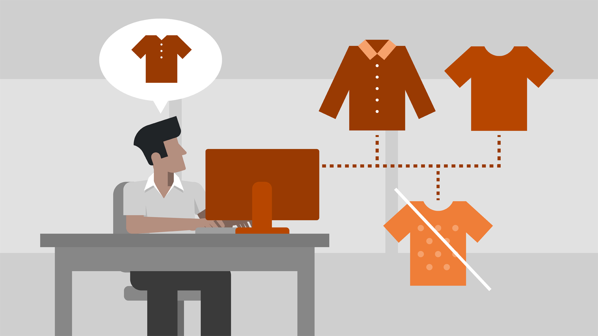
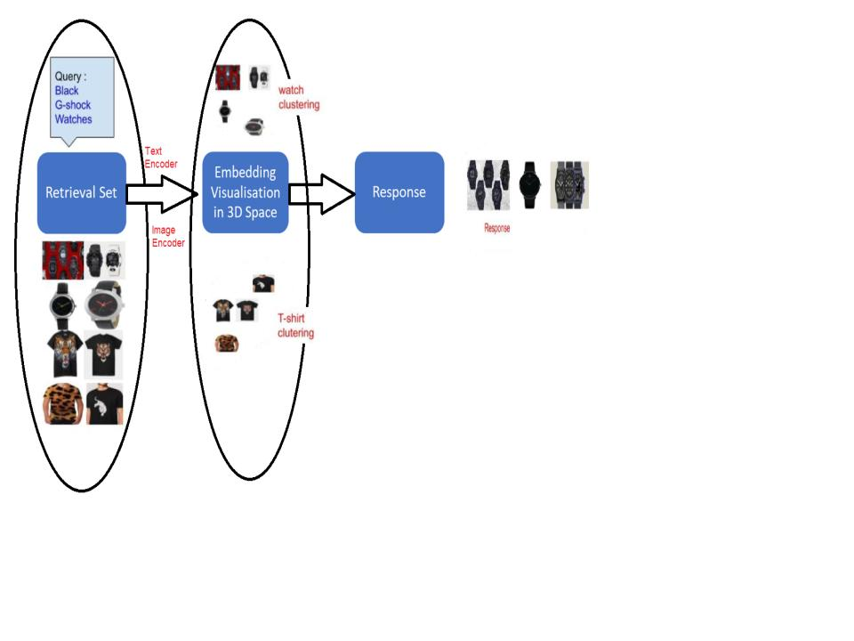
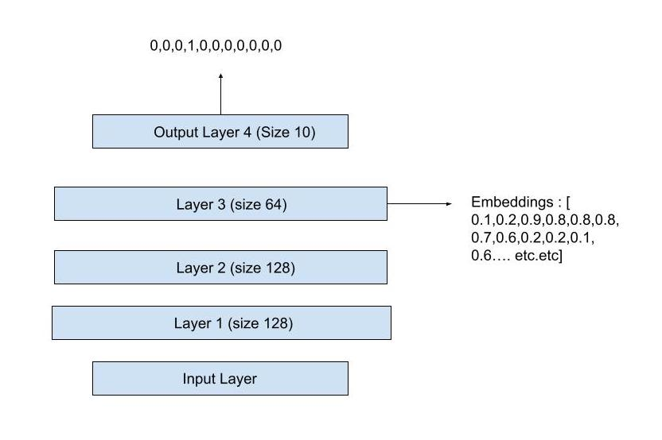
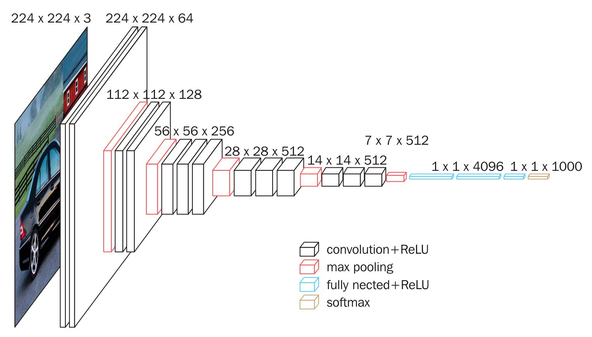
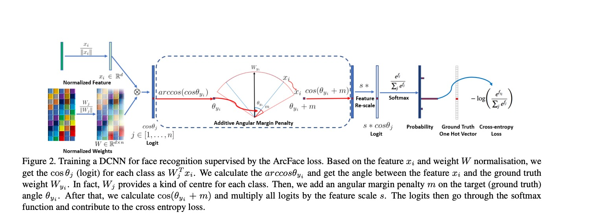
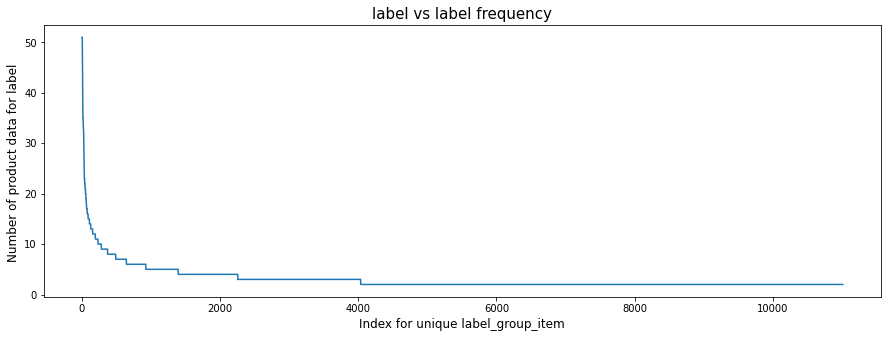

# Shopee-Product-Matching

## Business Problem

- Finding near-duplicates in large datasets is an important problem for many online businesses. In Every E-commerce website, everyday users can upload their own images and write their own product descriptions, adding an extra layer of challenge. 

- Task is to identify which products have been posted repeatedly. The differences between related products may be subtle while photos of identical products may be wildly different!

- Two different images of similar wares may represent the same product or two completely different items. Retailers want to avoid misrepresentations and other issues that could come from conflating two dissimilar products. 

## Understanding the data
We are using dataset provided by [Shopee Competition](https://www.kaggle.com/c/shopee-product-matching)

[train/test].csv - the training set metadata. Each row contains the data for a single posting. Multiple postings might have the exact same image ID, but with different titles or vice versa.
    
- posting_id - the ID code for the posting.
- image - the image id/md5sum.
- image_phash - a [perceptual hash](https://en.wikipedia.org/wiki/Perceptual_hashing) of the image.
- title - the product description for the posting.
- label_group - ID code for all postings that map to the same product. Not provided for the test set

[train/test]images - the images associated with the postings.
sample_submission.csv - a sample submission file in the correct format.

- posting_id - the ID code for the posting.
- matches - Space delimited list of all posting IDs that match this posting. Posts always self-match. Group sizes were capped at 50, so there's no need to predict more than 50 matches.

## Workflow

## High Level Solution Design 

We divide the overall solution in the following 3 parts.

1. **Learn to represent objects ( Product titles, product images) as a continuous dense vector** ( i.e. generate product title embeddings and product image embeddings)
2. **Learn to place similar objects together.** Similar product image should be in neighborhood, same way similar product title should be in same neighborhood. More difficult task would be to place a similar product title and similar product image in the same neighborhood. (Our next step)
3. Learned to **retrieve neighboring** objects and product embeddings **really fast.**

Let's simplify above steps further :

### Classification CNN
We were given information that **all the similar product have same label group**, We can leverage this information to build classification model to classify images into label group. 

we train a classification CNN by inputting product images and getting a one hot vector output that represents the label group of the image. For example, pretend we train a CNN to classify ten types of product items and input an image. Then the one-hot-vector output pictured below predicts product label group 4.

### Generating Embeddings 

Now imagine that we want to compare two product images (of product that are not one of the  label groups, or with in the label groups) and decide whether they are similar. Images are hard to compare, but numbers are easy to compare. So we input an image into a CNN and take the activations of the last layer before output layer, which we called dense representation of image aka image embedding. In the picture above that is a vector of dimension 64. So we can input two images, get two embeddings, and then compare the embeddings. The CNN embeddings are meaningful because they represent patterns that are detected in the images.

### Cosine Distance
We compare vectors (numbers) by computing the distance between them. What is the distance between the 3-dimensional vector [0.2, 0.9, 0.7] and [0.5, 0.4, 0.1]?

There is no right answer because there are many ways to calculate distance. This problem further can be solved using metric learning approach, I will try to explore this in my future work. In high school we learn Euclidean distance, then the answer would be sqrt( (0.5-0.2)**2 + (0.4-0.9)**2 + (0.1-0.7)**2 ). If you imagine the vectors as points in 3-space, then Euclidean distance is literally the distance between them.

And **cosine distance** would be **one minus the cosine of the angle from point one to the origin to point two.** 
**This equals 0 when the points are the same, and 1 when the points are far away.**

## List Of Approaches I tried In reversed Order of Performance Metric

1. **[ArcFace Loss F1 - Score : 0.72](notebooks/ArcfaceLoss[training].ipynb)**

   ### Approach

   - We would like similar classes ( Product belongs to same label_group) to have embeddings close to each other and dissimilar classes (Product belongs to different label_group) to be far from each other, But why would this happen? We didn't train our model to do this, we only trained our model to predict products accurately. 
   - ArcFace adds more loss to the training procedure to encourage similar class embeddings to be close and dissimilar embeddings to be far from each other. 
   
   
   ### Loss Description
   - Besides the backbone that extracts features, there is the head for classification with a fully connected layer with trainable weights.
   - The product of normalized weights and normalized features lie in the interval from -1 to 1. We can represent a logit for each class as the cosine of an angle between the feature and the ground truth weight inside a hypersphere with a unit radius.
   - Also, there are two hyperparameters m (the additional angular margin) and s (scaling ratio from a small number to a final logit) that help adjust the distance between classes.
   ### Results
   
   When I trained Product classification network with Arcface loss and generate embeddings using Arcface Backbone, F1 score improved from 0.62(Softmax Loss)  to 0.71, which is significant improvement, Arcface was handling class imbalance issue better than Softmax.
   
   ### How to train ArcFace Loss
   - Download dataset from  [Shopee Competition](https://www.kaggle.com/c/shopee-product-matching), and put it in `TRAIN_DIR` folder
   - set configuration parameters  in `Config.py` (Parameters are self-explanatory) 
   - Run `requirement.txt` to set up environment and files, or create new virtual environment and set up.
   - Run `python train.py`
   

   ### How to do inference using Pytorch Model
   - If you don't train model and want to use preprocessed embeddings, Download [pretrained_embeddings](https://www.kaggle.com/datasets/chiragtagadiya/training-embeddings-shopee) and put it in `TrainedEmbeddings` Directory
   - Run `python inference.py`

   ### How to start streamlit web app
   - Run `streamlit run streamlit_app.py`

   ### ArcFace Model Recommendation Results
   
2. [Product lassification using Weighted Random Sampler using multiclass Cross Entropy loss F1 Score 0.62](notebooks/ProductClassificationSoftmax[Training].ipynb)

    
   ### Solution Approach
    
   - We were given information that all the **similar product have same label group.** 
   - We can leverage this information to build **classification model to classify images into label group.**
   - From Image EDA, I found out that we have **11014** different classes, and dataset is **not balanced dataset**, If you see below plot, we can clearly see that there are **hardly 1000 data points having more than 10 products per label.**
   - In this notebook I used **Weighted Sampler technique used in pytorch for handling imbalanced classification problem**

  
  ### Results
    
  * Using **Weighted Sampler technique** really helped me to **improve classification accuracy** for **under represented label groups ( label groups for which only 2 product images** were available.
  * I achivied **0.62 F1 Score** which is significant improvement from earlier baseline model.
    
3. **[Convolution AutoEncoder - BaseLine F1 Score 0.51](notebooks/AutoEncoder[Baseline].ipynb)**
    ### Apparoach
    AutoEncoder model consist of two parts, Encoder  and Decoder. Encoder downsamples the image to lower dimension dimension features, and decoder is used to reconstruct the same image using latent dimension.
    
    My Hypothesis is that If I am able to regenerate the same image with with little error, then we can say that latent dimension is compressed and dense feature that captures the image information in lower dimension.
    
    After training model, we will pass all images to encoder to generate the latent features, we will store latent features to database. At test time, we will pass image to encoder to get query features. we will then compute the euclidean distance to all the features in database to get top predction. 
    
    ### Result:  
    F1 score for AutoEncoder model is 0.51 which is baseline for our case. AutoEncoder produce the decent result, but it is still not good approach to generate the semantically similar image.
    
    it is also error prone and give some useless result, in AutoEncoder we rely on MSE loss which will focus on reducing each pixel error distance, which is misleading in semantic similarity.
    
### Combined Results

| Model                                          | F1 Score | K Nearest-Neighbors   Distance  Metric | Distance Threshold for K Nearest   Neighbor |
|------------------------------------------------|----------|----------------------------------------|---------------------------------------------|
| AutoEncoder                                    | 0.51     | Euclidean                              | No Thresholding, directly return top k      |
| EffNet B3 SoftMax                              | 0.59     | Cosine                                 | 0.5                                         |
| EffNet B3 SoftMax Weighted   Sampler           | 0.62     | Cosine                                 | 0.5                                         |
| **EffNet B3 ArcFace**                              | **0.7**      | Cosine                                 | 0.3                                         |
| **EffNet B3 ArcFace Weighted   Sampler**           | **0.72**     | Cosine                                 | 0.3                                         |
| **EffNet B3 ArcFace Weighted   Sampler + TF-IDF**  | **0.74**     | Cosine                                 | For Image Model 0.3, For Text Model 0.17    |
| **Text IDF**                                       | **0.661**    | Cosine                                 | 0.55                                        |
| **Text TF-IDF**                                    | **0.648**    | Cosine                                 | 0.55                                        |
| GloVe                                          | 0.518    | Cosine                                 | 0.8                                         |
| GloVe + IDF                                    | 0.536    | Cosine                                 | 0.8                                         |